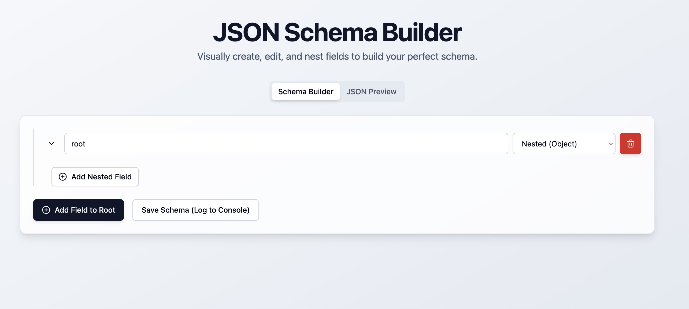

# JSON Schema Builder

A dynamic and responsive user interface for visually creating, editing, and nesting JSON schemas. Built with React, TypeScript, and Vite, this tool provides a real-time JSON preview and a clean, intuitive workflow.

**[➡️ Live Demo on Netlify](https://jsonshema-react-app.netlify.app/)** 🚀

---



## ✨ Features

* **Dynamic Field Management:** Easily add, edit, and delete schema fields on the fly.
* **Recursive Nesting:** Create complex data structures with deeply nested objects.
* **Type Support:** Includes String, Number, Float, Boolean, ObjectId, and Nested (Object) types.
* **Real-Time JSON Preview:** Instantly see the generated JSON output in a separate tab as you build your schema.
* **Randomized Preview Values:** Float and Boolean types generate random values in the preview for more realistic mock data.
* **Responsive Design:** A clean and modern UI that works seamlessly on desktop and mobile devices.
* **Professional Project Structure:** Code is logically separated into reusable UI components, feature components, and type definitions.

## 🛠️ Tech Stack

This project is built with a modern, professional tech stack:


## 🚀 Getting Started

To run this project on your local machine, follow these steps:

### Prerequisites

Make sure you have Node.js (v18 or higher) installed on your system.

### Installation & Setup

1.  **Clone the repository:**
    ```bash
    git clone [https://github.com/your-username/your-repo-name.git](https://github.com/your-username/your-repo-name.git)
    ```
2.  **Navigate to the project directory:**
    ```bash
    cd your-repo-name
    ```
3.  **Install dependencies:**
    ```bash
    npm install
    ```
4.  **Run the development server:**
    ```bash
    npm run dev
    ```
The application will be available at `http://localhost:5173`.

## 📂 Project Structure

The project is organized with a clear and scalable folder structure to promote maintainability and separation of concerns.

```
src/
├── components/      # Main feature components
│   ├── ui/          # Reusable, generic UI components (Button, Card, etc.)
│   ├── FieldRow.tsx
│   └── JsonPreview.tsx
├── types.ts         # Shared TypeScript type definitions
├── App.tsx          # Main application component (layout and state management)
└── main.tsx         # Entry point of the application
```
